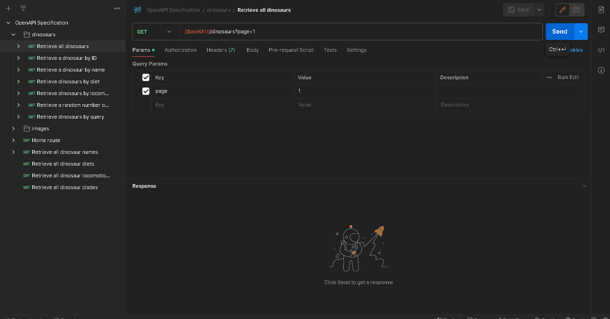

## API Endpoint and Description

`GET {baseUrl}/api/v1/dinosaurs?page={page}`

Returns all dinosaurs within the API, 50 dinosaurs per page.

## Parameters

-   `page`: The page number to retrieve, 50 dinosaurs are displayed per page.

## Demo

