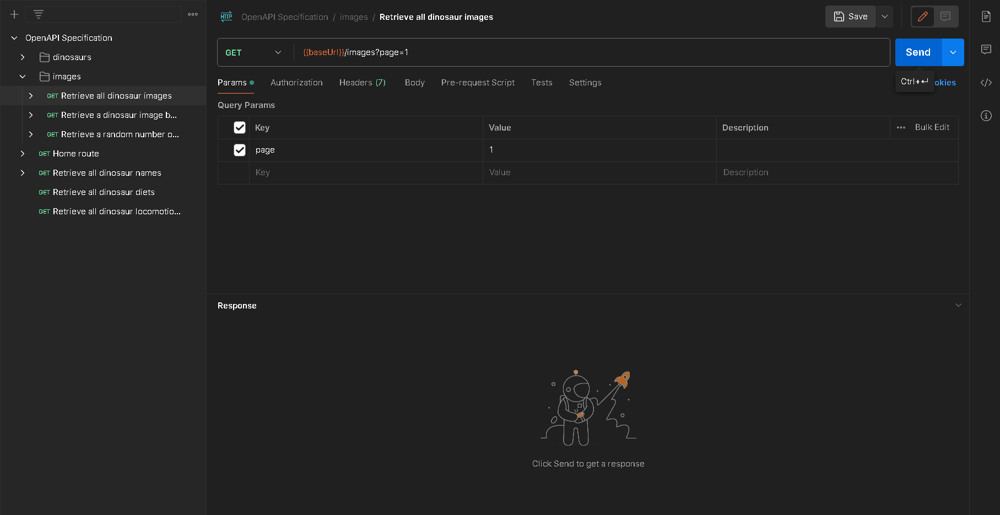

## API Endpoint and Description

`GET {baseUrl}/api/v1/images?page={page}`

Returns all dinosaur images within the API, 50 dinosaurs per page.

## Parameters

-   `page`: The page number to retrieve, 50 dinosaur images are displayed per page.

## Demo

