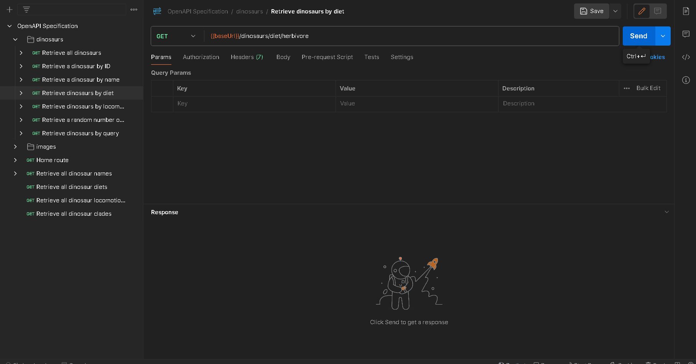

## API Endpoints and Description

`GET {baseUrl}/api/v1/dinosaurs/{diet}`

Returns all dinosaurs matching a specific diet.

## Parameters

-   `diet`: The diet of the dinosaurs you wish to retrieve.

Examples include: `herbivore`, `carnivore`, `omnivore`, `piscivore`, etc.

## Demo

