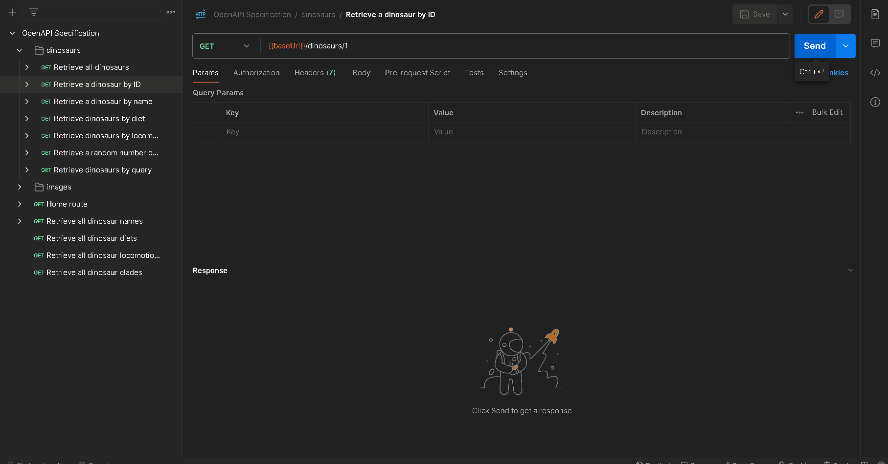

## API Endpoints and Description

`GET {baseUrl}/api/v1/dinosaurs/{id}`

Returns a dinosaur matching a specific id, returns an error if not found.

## Parameters

-   `id`: The id corresponding to the dinosaur you wish to retrieve. Must be an integer between `1` and `1153`.

## Demo

