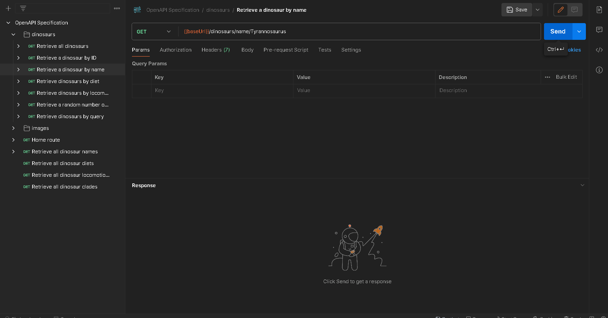

## API Endpoints and Description

`GET {baseUrl}/api/v1/dinosaurs/{name}`

Returns a dinosaur matching a specific name, returns an error if not found.

## Parameters

-   `name`: The name corresponding to the dinosaur you wish to retrieve.

## Demo

