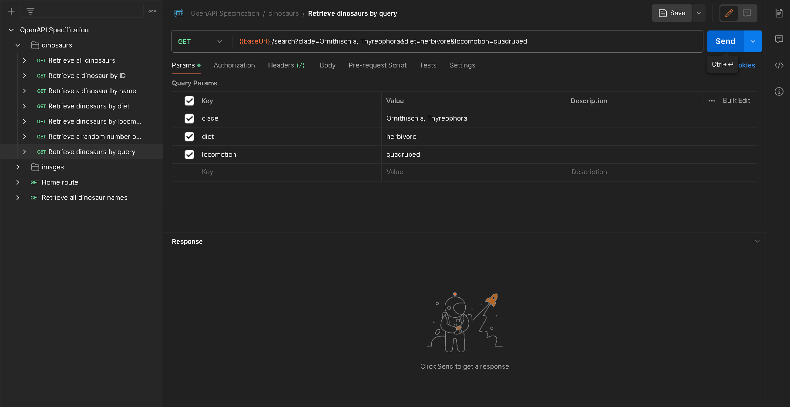

## API Endpoints and Description

`GET {baseUrl}/api/v1/search?clade={clade}&diet={diet}&locomotion={locomotion}`

Returns all dinosaurs matching a specific query.

## Parameters

All parameters are optional, however, if no parameters are passed to the API then an error message will be returned as a response.

-   `clade`: The group that the dinosaur belongs to within its classification. This can be passed in various ways:

    1. `GET {baseUrl}/api/v1/search?clade=clade1,clade2`
    2. `GET {baseUrl}/api/v1/search?clade=clade1&clade=clade2`

    **NOTE**: The result will contain dinosaurs that belong to **any** of the clades passed via this endpoint. Some of these clades
    may conflict with diet and locomotion if they are provided as well (i.e. passing `Theropoda` as a clade, with `herbivore` as a diet wont work as `Theropoda` consists of carnivores.)

-   `diet`: The diet of the dinosaurs you wish to retrieve.

-   `locomotion`: The locomotion of the dinosaurs you wish to retrieve.

Example `clade` include: `Therapoda`, `Sauropodamorpha`, `Ornithischia`, `Thyreophora`, etc.

Example `diet` include: `herbivore`, `carnivore`, `omnivore`, `piscivore`, etc.

Example `locomotion` include: `biped`, `quadruped`, `facultative biped`, `gliding`, `swimming`, etc.

## Demo

