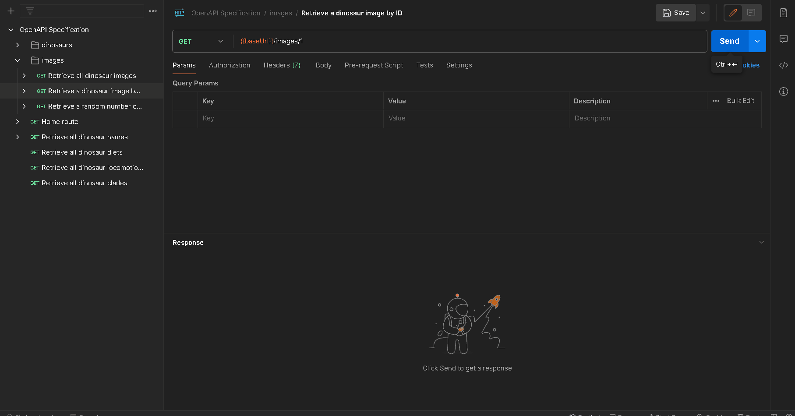

## API Endpoint and Description

`GET {baseUrl}/api/v1/images/{id}`

Returns a dinosaur image matching a specific id, returns an error if not found.

## Parameters

-   `id`: The id corresponding to the dinosaur image you wish to retrieve. Must be an integer between `1` and `1153`.

## Demo

