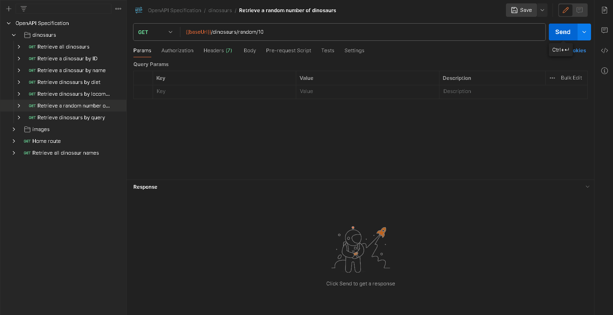

## API Endpoints and Description

`GET {baseUrl}/api/v1/dinosaurs/random/{count}`

Returns a random number of dinosaurs. Minimum of 1 and maximum of 10.

## Parameters

-   `count`: The number of random dinosaurs you wish to retrieve. Must be a valid
    integer between `1` and including `10`.

## Demo

