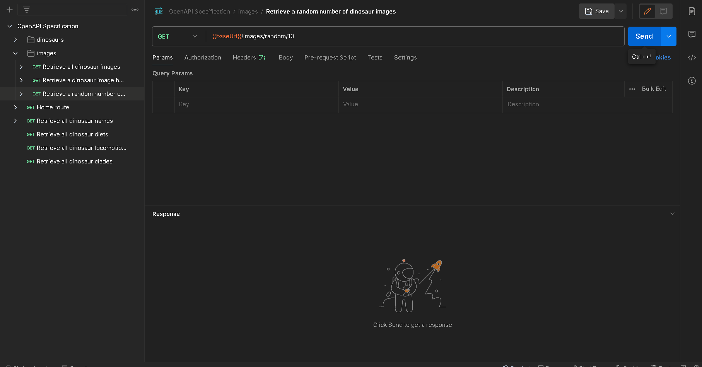

## API Endpoint and Description

`GET {baseUrl}/api/v1/images/random/{count}`

Returns a random number of dinosaur images. Minimum of 1 and maximum of 10.

## Parameters

-   `count`: The number of random dinosaur images you wish to retrieve. Must be a valid integer between `1` and including `10`.

## Demo

