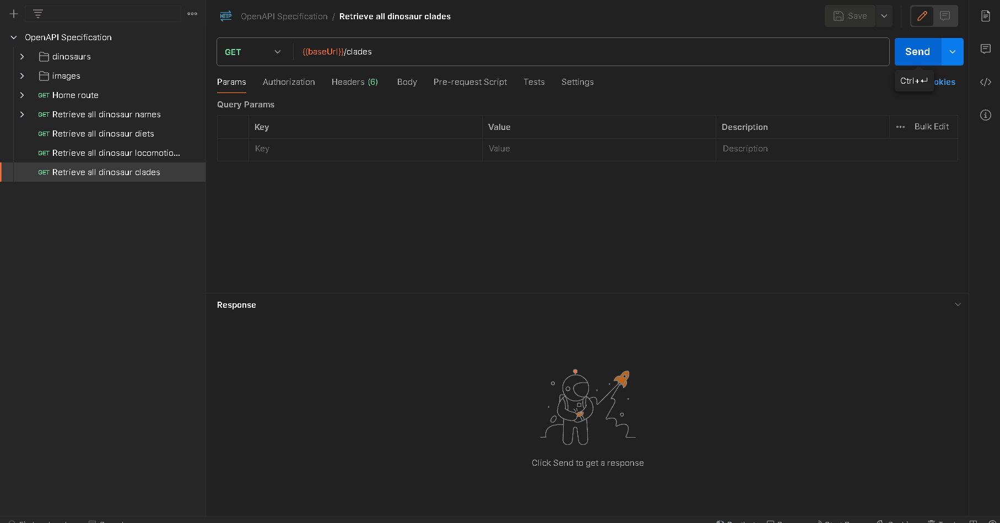

## API Endpoint and Description

`GET {baseUrl}/api/v1/clades`

Returns all dinosaur clades that exist within the API.

## Parameters

No parameters are required for this endpoint.

## Response Structure

```json
[
  {
    "clade": "Dinosauria",
    "count": 850
  },
  {
    "clade": "Ornithischia", 
    "count": 450
  }
]
```

## Demo



## Related

- [OpenAPI Specification for Route](/api/restasaurus#tag/general-metadata/get-/clades)
