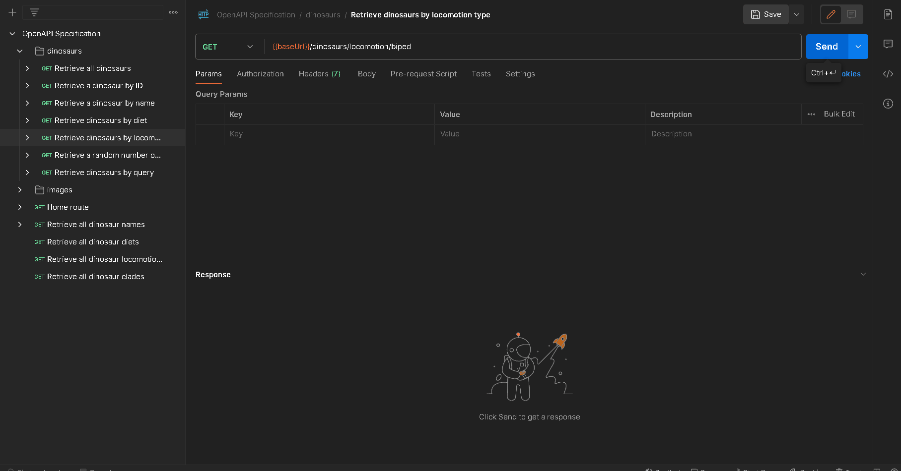

## API Endpoints and Description

`GET {baseUrl}/api/v1/dinosaurs/{locomotion}`

Returns all dinosaurs matching a specific locomotion type.

## Parameters

-   `locomotion`: The locomotion of the dinosaurs you wish to retrieve.

Examples include: `biped`, `quadruped`, `facultative biped`, `gliding`, `swimming`, etc.

## Demo

