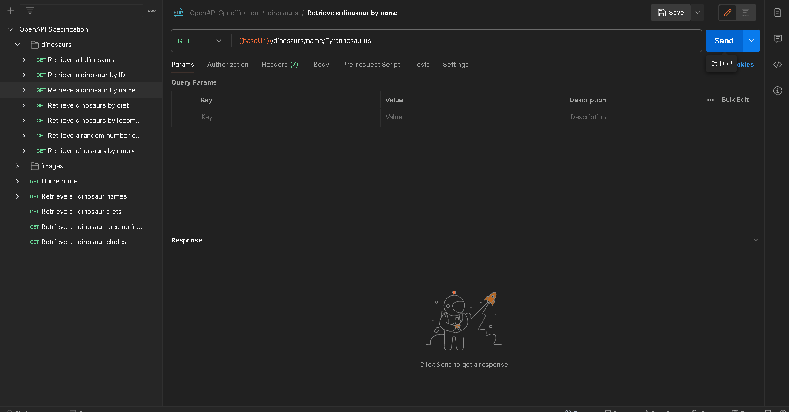

## API Endpoint and Description

`GET {baseUrl}/api/v1/dinosaurs/name/{name}`

Returns a dinosaur matching a specific name, returns an error if not found.

## Parameters

| Parameter | Type | Required | Description | Example |
|-----------|------|----------|-------------|---------|
| `name` | string | Yes | The name of the dinosaur to retrieve | `"Tyrannosaurus"` |

## Response Structure

```json
{
  "id": 1118,
  "name": "Zephyrosaurus",
  "temporalRange": "Early Cretaceous, ~113 Ma",
  "diet": "herbivore",
  "locomotionType": "biped",
  "description": "Zephyrosaurus (meaning \"westward wind lizard\")...",
  "classificationInfo": {...},
  "image": {...},
  "source": {...}
}
```

## Demo



## Related

- [OpenAPI Specification for Route](/api/restasaurus#tag/dinosaur-information/get-/dinosaurs/name/{name})
