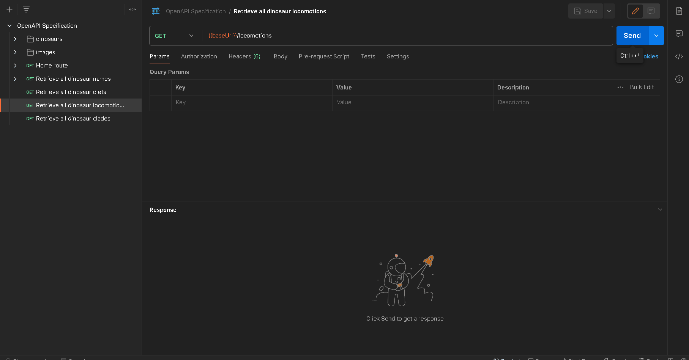

## API Endpoint and Description

`GET {baseUrl}/api/v1/locomotions`

Returns all dinosaur locomotions that exist within the API.

## Parameters

No parameters are required for this endpoint.

## Response Structure

```json
[
  {
    "locomotionType": "biped",
    "count": 450
  },
  {
    "locomotionType": "quadruped",
    "count": 380
  },
  {
    "locomotionType": "facultative biped",
    "count": 200
  },
  {
    "locomotionType": "gliding",
    "count": 100
  },
  {
    "locomotionType": "swimming",
    "count": 58
  }
]
```

## Demo



## Related

- [OpenAPI Specification for Route](/api/restasaurus#tag/general-metadata/get-/locomotions)
